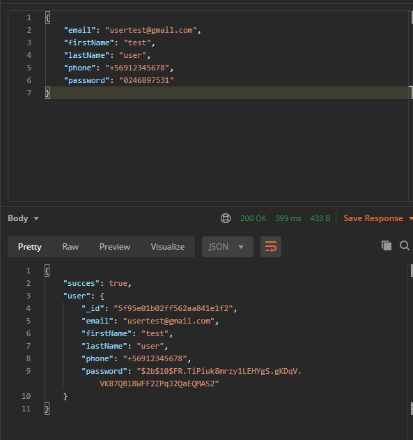
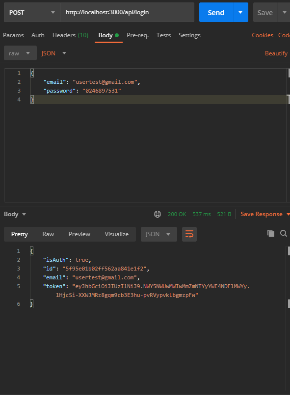
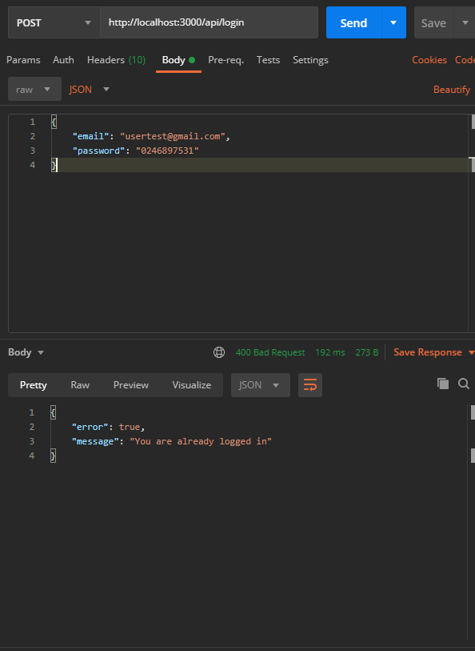
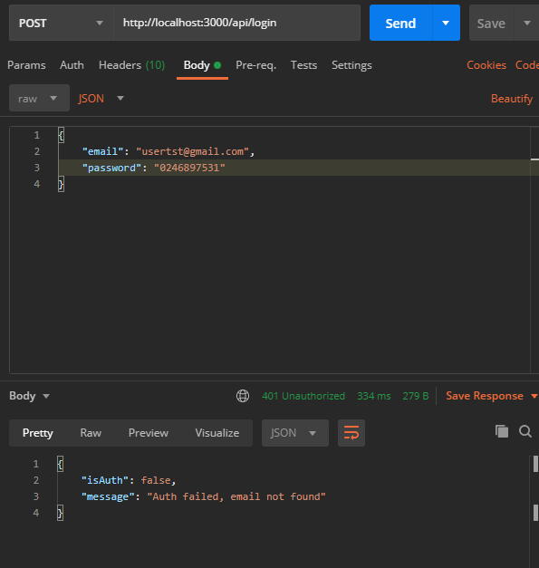
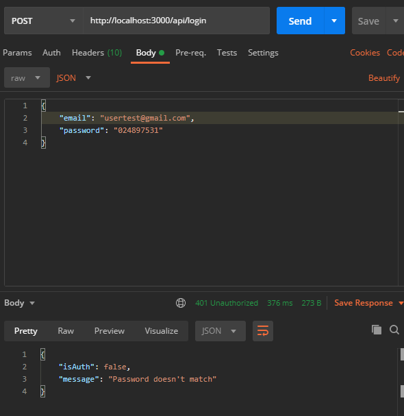
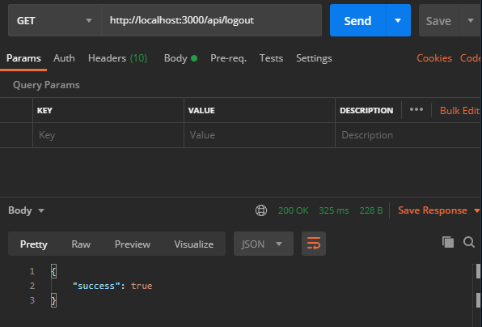
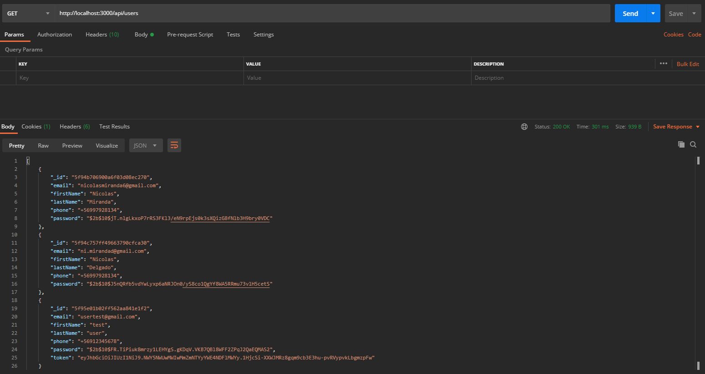
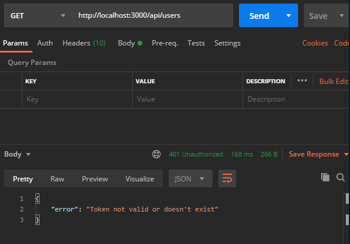

# nodejs-express-auth

This project consists of an API that allows users to register, authenticate the user (login), close the session and consult for all the users that are in the database.

It is worth mentioning that this project uses MongoDB as a database and that JSON Web Token is used for authentication. Dotenv is also used to protect environment variables (a copy of the .env file is left in the repository).

## Installation
To install the dependencies it's neccesary to run the following command:

```bash
npm install
```

## Running the app

To running the app you need to run:

```bash
npm run start
```

## REST paths and using Postman to show the results
The project uses 4 routes to consume the REST service and then the result of each of the routes will be shown:

### Path 1: Sign up a User

This path receives a basic user information and a password, and stores it into the database. It's neccesary to enrypt the password before being stored.

#### URL
```bash
## POST Method
http://localhost:3000/api/signup
```



It should be mentioned that all the fields are required for registration, and that it was also worth that the email is unique.

### Path 2: Login as User

Receives a registered email and its password. Needs to return a 200 code with the JWT acces token and also deliver the user id and user email. Also needs to return a 401 code if the login information is incorrect and a 400 code if the user is already logged in.

#### URL
```bash
## POST Method
http://localhost:3000/api/login
```
* **Login**

    

* **Already logged**

    

* **Wrong Email**

    

* **Wrong Password**

    


### Path 3: Logout

Simple GET method that allows logout the user session by sending a 200 code and a boolean assuming that the operation was successful.

#### URL
```bash
## GET Method
http://localhost:3000/api/logout
```



### Path 4: Get Users

Returns a list of all users stored in the database. This route must
be protected, reading the access token passed by the user and checking if it's valid. It needs to return a 401 code if the token is not valid or not present.

#### URL
```bash
## GET Method
http://localhost:3000/api/users
```

* **Get a list when the user is logged in**

    

* **Get an error when the user is logged out**

    


## Q&A

* **Q: What is the difference between JWT and OAuth authentication?**
    
    **A:** JWT is an authentication protocol based on an open standard, which defines the set of operations to issue and validate signed tokens. The standard defines the internal structure that the token contains. The information contained within this token is a JSON format and the signing method can range from an HMAC algorithm to an RSA public / private key pair.

    OAuth is an authorization framework, which provides guidance in defining specific authorization flows to access user data from different types of consuming applications. Different types of tokens are used in OAuth, including the JWT token itself.

* **Q: Explain how asymmetric encryption works.**
    
    **A:** It is based on an information encoding based on two keys: one private and one public. In this way, the sender keeps the private key and the public key can be given to any recipient. The Private Key allows decryption of all messages encrypted with the public key; with the public one we can only decrypt the messages encrypted with the original private key.

    *Note: The public key can encrypt messages that are only decrypted with the private key. This means that no one with the public key can decrypt that message. For this reason, confidentiality arises, since only the receiver can interpret the message.

    With the private key we can encrypt information as long as the person has the public key pair. This process does not provide the same confidentiality, since anyone with the public key could read the message, but it does give the messages authenticity. This is because only the one with the private key can encrypt the information in the way that only the one with the public key can decrypt it.


* **Q: What are the main differences between a GraphQL and REST API?**
    
    **A:** The main differences are:

    - The important difference is that GraphQL is not dealing with dedicated resources. Furthermore, all resources are considered rather as a whole as a set of interconnected graphs. This means that you can tailor your query to the client's needs using the GraphQL query language (based on Schemas) describing what they would like to have as a response, as well as combining different entities (or types) in a query and what attributes they should be included in the answer for each level.

    - A REST API embraces the concept of having multiple endpoints, therefore multiple paths of your web service will be exposed. On the other hand, a GraphQL API will only expose a single endpoint or route which is usually called / graphql, although you can assign it whatever name you want.

    - A REST API reacts in different ways depending on the existing HTTP methods (GET, POST, PUT, DELETE). A GraphQL API will only use the POST method.

    - GraphQL solves the problem that REST has related to Over Fetching and Under Fetching, that is, it may be the case that with a RESTful service we have excess or missing data. Each endpoint has a fixed structure of data that will be returned each time a request is made.